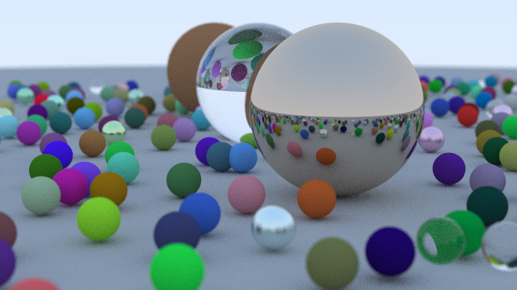
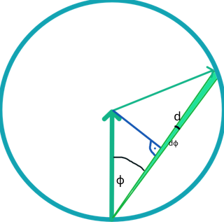
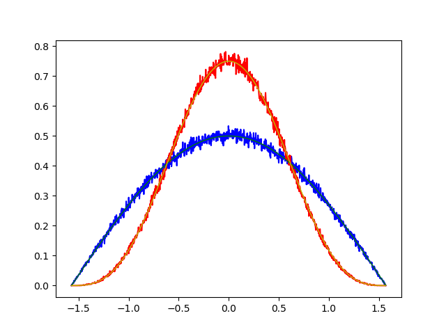

# Pathtracer

Based on the book [Raytracing in one week](https://github.com/RayTracing/raytracing.github.io)

## Sample image



## Cos distribution
Two algorithm which should give random direction vectors with cos distribution were used in the book.
The first turned out to be a cos³ distribution.

Reasonability why random_in_unit_sphere() gives a cos³ distribution.



random in unit circle:
* length of line d(ϕ) ~ cos(ϕ)
* area between d(ϕ) and d(ϕ+dϕ) ~ cos²(ϕ)

For a sphere the probablitiy density would be calculated with a infinitesimal small volume -> cos³(ϕ).

With [sources/python/random_unit.py](sources/python/random_unit.py) it's checked numerically which distribution the both algorithm give. Just to be sure the theory is right.

* Red -> random_in_unit_sphere()
* Blue -> random_unit_vector()
* Yellow -> cos³ distribution
* Green -> cos distibution



## Build
Release
```
mkdir build_release && cd build_release
cmake -DCMAKE_BUILD_TYPE=Release ..
make
```

Debug
```
mkdir build && cd build
cmake ..
make
```